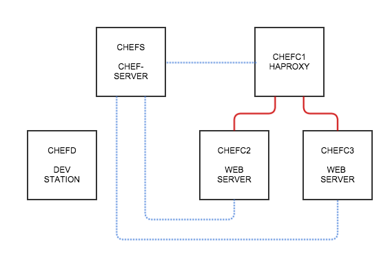

footer: _© Zendesk, 2014_ - Cassiano Aquino - caquino@zendesk.com
slidenumbers: true

#[FIT]C🍲🍲KING
#[FIT]WITH
#[FIT]BUDDHY

---
# REQUIREMENTS
1. Homebrew _http://brew.sh/_ (*brew doctor!*)
1. brew-cask _brew install caskroom/cask/brew-cask_
1. Virtualbox _brew cask install virtualbox_
1. Vagrant _brew cask install vagrant_
1. Git _brew install git_

---
# Lab 
## bootstrap
1. git clone http://github.com/caquino/chef-class
1. cd chef-class
1. vagrant up

---
# LAB
## DIAGRAM


---
# Lab 
## VM's
* Server (SSH/WEB INTERFACE) _hostname_: chefs
* Client (SSH) _hostname_: chefc1, chefc2
* Development station (SSH) _hostname_: chefd

_SSH Access_: vagrant ssh _<hostname>_ e.g: (chefs|chefc1|chefc2|chefd)

_WEB-UI Access_: http://chefs.local

---
# KNIFE 
## configuration
1. User private key _web-ui_
Access WEB-UI go to _Users -> Create_
Make sure you select _admin_
Save the private key at _chefd:~vagrant/.chef/<username>.pem_
1. Validation private key _chefs:/etc/chef-server_
save the file at _~/.chef/chef-validator.pem_

___
# KNIFE 
## configuration 
```
vagrant@chefd:~$ vi ~/.chef/knife.rb
```
```ruby
user = ENV['USER'] || 'YOUR USERNAME'
node_name user
client_key "#{ENV['HOME']}/.chef/#{user}.pem"
validation_client_name "chef-validator"
validation_key "#{ENV['HOME']}/.chef/chef-validator.pem"
chef_server_url "https://chefs.local/"
syntax_check_cache_path "#{ENV['HOME']}/.chef/syntax_check_cache"
cookbook_path [ "#{ENV['HOME']}/chef/cookbooks" ]
knife[:editor]="/usr/bin/vi"
```

___
# BOOTSTRAP
### Basic
- Register a new client on chef-server using chef-validator.pem
- Creates a new node on the chef-server

```
vagrant@chefd:~$ knife bootstrap -x vagrant chefc1.local -N chefc1.local --sudo
vagrant@chefd:~$ knife bootstrap -x vagrant chefc2.local -N chefc2.local --sudo
vagrant@chefd:~$ knife bootstrap -x vagrant chefc3.local -N chefc3.local --sudo
vagrant@chefd:~$ printf "%s\n" {1..3} | xargs -P 3 -I % knife bootstrap -x vagrant 
chefc%.local -N chefc%.local --sudo
```

---
# ENVIRONMENTS
- map an organization’s real-life workflow 
e.g: _production, staging, testing, and development environments._
- also associated with one (or more) cookbook versions.

```
vagrant@chefd:~$ knife environment create lab_environment
vagrant@chefd:~$ knife environment list
vagrant@chefd:~$ knife node environment_set chefc1.local lab_environment
vagrant@chefd:~$ knife node environment_set chefc2.local lab_environment
vagrant@chefd:~$ knife node environment_set chefc3.local lab_environment

vagrant@chefd:~$ printf "%s\n" {1..3} | xargs -P 3 -I % knife node 
environment_set chefc%.local lab_environment
```

---
# Nodes 
- physical, virtual, or cloud machine that is configured to be maintained by a chef-client.
- attributes and a run_list e.g:

```
vagrant@chefd:~$ knife node <show|edit|delete> <nodename> [-l]
vagrant@chefd:~$ knife node show chefc2.local
vagrant@chefd:~$ knife node show -l chefc1.local | less
vagrant@chefd:~$ knife node edit chefc1.local 
```
---
# RUN_LIST

- defines configuration settings that are necessary for a node that is under management by Chef to be put into the desired state.

- ordered list of roles and/or recipes

---
# Attributes
- ohai _automatic attributes_
try it! vagrant@chefc1:~/$ _ohai_
- cookbooks _code / attributes file_
- roles 
- environment
- node

---
# Roles
- zero (or more) attributes and a run-list
- nodes can be part of zero (or more)
- attributes and run_lists shared accross nodes

e.g:
dbservers, webservers, base_role

```
vagrant@chefd:~$ knife role list
vagrant@chefd:~$ knife role create lab_web_role
vagrant@chefd:~$ knife role create lab_lb_role
```

---
# Chef-client
## how to execute?

```
vagrant@chefd:~$ ssh chefc1.local sudo /usr/bin/chef-client
vagrant@chefd:~$ ssh chefc2.local sudo /usr/bin/chef-client
vagrant@chefd:~$ ssh chefc3.local sudo /usr/bin/chef-client

vagrant@chefd:~$ printf "%s\n" {1..3} | 
xargs -P 3 -I % ssh chefc%.local sudo /usr/bin/chef-client
```

---
# Cookbooks
- fundamental unit of configuration and policy distribution. 
- defines a scenario, e.g: _everything needed to install and configure MySQL_
-  all of the components that are required to support that scenario, e.g: _Attributes, Files, Recipes, Resources, Providers, Templates, Versions, Metadata_


---
# Cookbooks
## lab
```
vagrant@chefd:~/$ knife cookbook create lab_nginx_cookbook
vagrant@chefd:~/$ knife cookbook create lab_haproxy_cookbook
```

---
# Cookbooks
## metadata
```
vagrant@chefd:~/chef/cookbooks/lab_nginx_cookbook$ vi metadata.rb
```
```ruby
name             'lab_nginx_cookbook'
maintainer       'Zendesk International'
maintainer_email 'caquino@zendesk.com'
license          'All rights reserved'
description      'Installs/Configures lab_nginx_cookbook'
long_description IO.read(File.join(File.dirname(__FILE__), 'README.md'))
version          '0.1.0'
```

___
#Cookbooks
## metadata - support and depends

```ruby
%{ ubuntu redhat }.each do |os|
  supports os
end
%{ ohai chef_handler }.each do |package|
  depends package
end
supports "ubuntu"
supports "redhat"
depends "ohai"
depends "chef_handler"
```

---
#Cookbooks
## recipes
```
vagrant@chefd:~/chef/cookbooks/lab_nginx_cookbook$ vi recipes/default.rb
```
```ruby
package "nginx" do
	action :upgrade
end

file "/usr/share/nginx/www/index.html" do
	content node[:hostname]
end

service "nginx" do
	action [:enable, :start]
	supports :reload => true
end
```

---
#Cookbooks
##Upload
```
vagrant@chefd:~/$ knife cookbook upload lab_nginx_cookbook
```

---
# Roles and multiple nodes
```
vagrant@chefd:~$ knife role edit lab_web_role
{
...
  "run_list": [
    "recipe[lab_nginx_cookbook]"
  ],
...
}
```

---
# Run list and nodes

```
vagrant@chefd:~$ knife node run_list add chefc2.local "role[lab_web_role]"
vagrant@chefd:~$ knife node run_list add chefc3.local "role[lab_web_role]"
vagrant@chefd:~$ ssh chefc2.local sudo /usr/bin/chef-client
vagrant@chefd:~$ ssh chefc3.local sudo /usr/bin/chef-client
```

---
#Cookbooks
## metadata
```
vagrant@chefd:~/chef/cookbooks/lab_haproxy_cookbook$ vi recipes/default.rb
```
```ruby
name             'lab_haproxy_cookbook'
maintainer       'Zendesk International'
maintainer_email 'caquino@zendesk.com'
license          'All rights reserved'
description      'Installs/Configures lab_haproxy_cookbook'
long_description IO.read(File.join(File.dirname(__FILE__), 'README.md'))
version          '0.1.0'
```

---
# Cookbooks
### recipes - haproxy
```
vagrant@chefd:~/chef/cookbooks/lab_haproxy_cookbook$ vi recipes/default.rb
```
```ruby
package "haproxy" do
        action :upgrade
end

pool_members = search("node", "role:lab_web_role")

template "/etc/haproxy/haproxy.cfg" do
        source "haproxy.cfg.erb"
        owner "root"
        group "root"
        mode "0644"
        variables :pool_members => pool_members.uniq
        notifies :reload, "service[haproxy]", :delayed
end

cookbook_file "haproxy-default" do
      path "/etc/default/haproxy"
      owner "root"
      group "root"
      mode 0644
      notifies :restart, "service[haproxy]", :delayed
end

service "haproxy" do
        action [:enable, :start]
        supports :reload => true
end
```

---
# Cookbooks
## recipes - haproxy

```ruby
...

pool_members = search("node", "role:lab_web_role")

template "/etc/haproxy/haproxy.cfg" do
        source "haproxy.cfg.erb"
        owner "root"
        group "root"
        mode "0644"
        variables :pool_members => pool_members.uniq
        notifies :reload, "service[haproxy]", :delayed
end

...
```

---
#Cookbooks
##Templates
```
vagrant@chefd:~/chef/cookbooks/lab_haproxy_cookbook$ mkdir -p templates/default/
vagrant@chefd:~/chef/cookbooks/lab_haproxy_cookbook$ vi templates/default/haproxy.cfg.erb
```
```ruby
global
        user haproxy
        group haproxy
        daemon
   
listen http 0.0.0.0:80
        <% @pool_members.each do |member| -%>
        server <%= member[:hostname] %> <%= member[:network][:interfaces][:eth1][:addresses].select 
        { |address, data| data[:family] == 'inet' }.keys[0] %>
			<% end -%>  

<% if node["haproxy"]["enable_admin"] -%>
listen admin 0.0.0.0:22002
	mode http
	stats uri /
<% end -%>
```


---
# Cookbooks
## recipes - haproxy
```ruby
...
cookbook_file "haproxy-default" do
      path "/etc/default/haproxy"
      owner "root"
      group "root"
      mode 0644
      notifies :restart, "service[haproxy]", :delayed
end
...
```


---
#Cookbooks
##Files
```
vagrant@chefd:~/chef/cookbooks/lab_haproxy_cookbook$ vi files/default/haproxy-default
```
```ruby
# Set ENABLED to 1 if you want the init script to start haproxy.
ENABLED=1
# Add extra flags here.
#EXTRAOPTS="-de -m 16"
```

---
#Cookbooks
##Attributes
```
vagrant@chefd:~/chef/cookbooks/lab_haproxy_cookbook$ vi attributes/default.rb
```
```ruby
default["haproxy"]["enable_admin"] = false
```

---
#Cookbooks
##Upload
```
vagrant@chefd:~$ knife cookbook upload lab_haproxy_cookbook
```

---
# Roles and multiple nodes
```
vagrant@chefd:~$ knife role edit lab_lb_role
{
...
  "run_list": [
    "recipe[lab_haproxy_cookbook]"
  ],
...
}
```

---
# Run list and nodes

```
vagrant@chefd:~$ knife node run_list add chefc1.local "role[lab_lb_role]"
vagrant@chefd:~$ ssh chefc1.local sudo /usr/bin/chef-client
```

---
# Node attributes
```
vagrant@chefd:~$ knife node edit chefc1.local
```
```json
{
  "name": "chefc1.local",
  "chef_environment": "lab_environment",
  "normal": {
    "haproxy": {
        "enable_admin": true
    },
    "tags": [

    ]
  },   "run_list": [
    "role[lab_lb_role]"
  ]
 
}
```
```
vagrant@chefd:~$ ssh chefc1.local sudo /usr/bin/chef-client
```

---
# Attributes
## Precedence


---
# LAB Recap
```
node[chefc1.local]
	role[lab_lb_role]
		recipe[lab_haproxy_cookbook]
		
node[chefc2.local]
	role[lab_web_role]
		recipe[lab_nginx_cookbook]
		
node[chefc3.local]
	role[lab_web_role]
		recipe[lab_nginx_cookbook]
```
	
---
# Data bags
- global variable that is stored as JSON data
- indexed for searching and can be loaded by a recipe or accessed during a search.

e.g:
database_clusters, users

---
# Data bags
```
vagrant@chefd:~$ knife data bag create lab_environment_secrets haproxy
```
```json
{
  "id": "haproxy",
  "admin": {
    "port": 8081,
    "username": "admin",
    "password": "whatever"
  }
}
```

---
# Cook books
```
...
pool_members = search("node", "role:lab_web_role")
config = data_bag_item("lab_environment_secrets", "haproxy")
...
template "/etc/haproxy/haproxy.cfg" do
        source "haproxy.cfg.erb"
        owner "root"
        group "root"
        mode "0644"
        variables ({
                        :pool_members => pool_members.uniq,
                        :admin => config['admin']
                  })
        notifies :restart, "service[haproxy]", :delayed
end
...
```

---
#Cookbooks
##Templates
```
vagrant@chefd:~/chef/cookbooks/lab_haproxy_cookbook$ vi templates/default/haproxy.cfg.erb
```
```ruby
global
  user haproxy
  group haproxy
  daemon
   
listen http 0.0.0.0:80
  <% @pool_members.each do |member| -%>
  server <%= member[:hostname] %> <%= member[:network][:interfaces][:eth1][:addresses].select 
  { |address, data| data[:family] == 'inet' }.keys[0] %>
	<% end -%>  

<% if node["haproxy"]["enable_admin"] -%>
listen admin 0.0.0.0:<%= @admin["port"] %>
   mode http
	stats uri /
	stats auth <%= @admin["username"] %>:<%= @admin["password"] %>
<% end -%>
```

---
#Cookbooks
##Upload
```
vagrant@chefd:~$ knife cookbook upload lab_haproxy_cookbook
vagrant@chefd:~$ ssh chefc1.local sudo /usr/bin/chef-client
```

---
# Version Freeze
```
vagrant@chefd:~$ knife environment edit lab_environment
```
```json
{
...
  "cookbook_versions": {
    "lab_nginx_cookbook": "= 0.1.0"
  },
...
}
```

---
# Cookbook
```
vagrant@chefd:~/chef/cookbooks/lab_nginx_cookbook$ vi recipes/default.rb
```
```ruby
...
file "/usr/share/nginx/www/index.html" do
        content "Node: #{node[:fqdn]}"
end
...
```

---
# Cookbook
## metadata
```
vagrant@chefd:~/chef/cookbooks/lab_nginx_cookbook$ vi metadata.rb
```
```ruby
...
version "0.1.1"
...
```

---
#Cookbooks
##Upload
```
vagrant@chefd:~$ knife cookbook upload lab_nginx_cookbook
vagrant@chefd:~$ ssh chefc2.local sudo /usr/bin/chef-client
vagrant@chefd:~$ ssh chefc3.local sudo /usr/bin/chef-client

```

---
#Cookbooks
## versions
```
vagrant@chefd:˜$ knife cookbook show lab_nginx_cookbook
```

---
#Cookbook
## version bump
```
vagrant@chefd:~$ knife environment edit lab_environment
```
```json
{
...
  "cookbook_versions": {
    "lab_nginx_cookbook": "= 0.1.1"
  },
...
}
```

---
#chef client
```
vagrant@chefd:~$ ssh chefc2.local sudo /usr/bin/chef-client
vagrant@chefd:~$ ssh chefc3.local sudo /usr/bin/chef-client

```
---
#Conclusions
##what we saw?

- Nodes (bootstraping, run_list, attributes)
- Environments (creation, cookbooks freeze, attributes)
- Roles (creation, run_list, attributes)
- Cookbooks (creation, upload, templates, files, recipes, versioning, search)
- Data bags (creation, usage)

---
# Rapid review
## Commands

```
knife client <edit|show|delete|list> client_name

knife user <edit|show|delete|add|list> user_name

knife node <edit|show|delete|list> node_name

knife cookbook <upload|show|delete|create|list> cookbook_name 

knife environment <edit|show|delete|create|list> [from file] environment_name|file_name.json

knife role <edit|show|delete|create|list> [from file] role_name|file_name.json

knife data bag <edit|show|delete|create|list> [from file] data_bag_name item_name|file_name.json
```

---
#BONUS CONTENT
- open source cookbooks

###ADVANCED CLASS - TODO
- LWRP's
- Template Helpers
- Reporting Handlers
- Testing (chefspec, serverspec, minitest-handler, berkshelf, kitchen)

---

# [FIT]THANKS